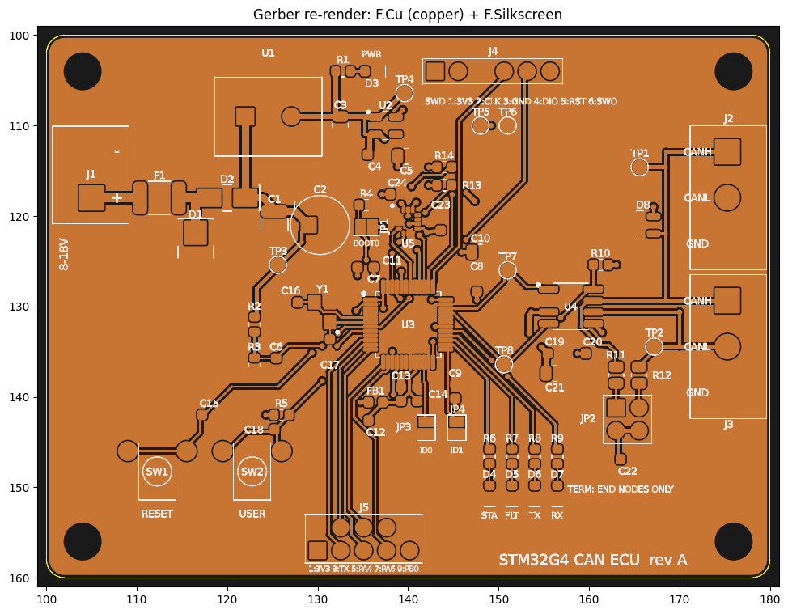
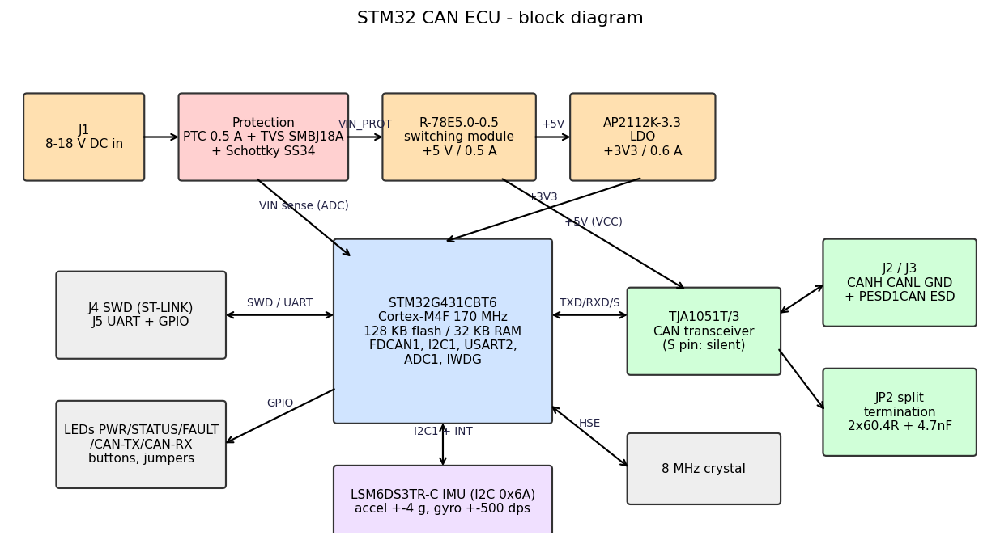

# STM32 CAN ECU – development board (rev A)

A compact, "ECU-style" CAN node for learning and prototyping automotive-type embedded software. It has an STM32G4 MCU, a CAN transceiver with protection and switchable termination, a 6-axis IMU, a protected 8-18 V supply, SWD, a UART, LEDs and buttons.

Two or more identical boards talk to each other over CANH/CANL/GND. Each board broadcasts:

* a heartbeat,
* IMU data,
* supply voltage,
* diagnostics.

Each board also supervises its peers.



## Quick facts

| | |
|---|---|
| MCU | **STM32G431CBT6** (Cortex-M4F 170 MHz, 128 KB flash, 32 KB RAM, LQFP48) |
| CAN transceiver | **NXP TJA1051T/3** (5 V VCC, 3.3 V VIO), PESD1CAN ESD, split termination on jumper |
| IMU | **ST LSM6DS3TR-C** (accel ±4 g, gyro ±500 dps, I2C 0x6A) |
| Supply | **8-18 V DC** (12 V nominal): PTC + TVS + reverse-polarity diode → RECOM R-78E5.0-0.5 (5 V) → AP2112K-3.3 LDO |
| Power | ≈ 0.35 W typical, < 0.85 W worst case (≈ 28 mA typical / 67 mA worst case at 12 V) |
| PCB | **80 × 60 mm, 4 layers** (signal / GND / 3V3 / signal), 1.6 mm, 4 × M3 |
| CAN | classic CAN 500 kbit/s, 11-bit IDs, counter + CRC-8 on every frame |
| Est. BOM cost | ≈ USD 19 components per board (qty 10, rough estimate) + PCB |
| Tools | KiCad 7/8/9, STM32CubeIDE or CMake + arm-none-eabi-gcc, ST-LINK |

## Repository layout

```
README.md                  this file
docs/                      all documentation (start with BRINGUP.md when your boards arrive)
hardware/kicad/            KiCad project: CAN_ECU.kicad_pro / .kicad_sch / .kicad_pcb + libraries
hardware/fab/              preview Gerbers, drill files, BOM.csv, CPL_top.csv
hardware/gen/              Python generators + independent checkers (how rev A was produced)
firmware/                  STM32Cube HAL firmware (CMake / CubeIDE), host unit tests
tools/                     can_ecu.dbc, Python decoder/monitor (python-can)
```

## Architecture



| Document | Content |
|---|---|
| [docs/DESIGN_NOTES.md](docs/DESIGN_NOTES.md) | architecture, all design decisions, circuit calculations, **assumptions list**, limitations, future work |
| [docs/POWER_CALCS.md](docs/POWER_CALCS.md) | per-rail current budget, regulator dissipation, input current, total power |
| [docs/PIN_MAPPING.md](docs/PIN_MAPPING.md) | all 48 MCU pins, alternate functions, connector and jumper pinouts |
| [docs/COMPONENTS.md](docs/COMPONENTS.md) | component list and footprint list (with **VERIFY** notes) |
| [docs/PCB_LAYOUT.md](docs/PCB_LAYOUT.md) | stack-up, rules, placement and routing strategy |
| [docs/CAN_PROTOCOL.md](docs/CAN_PROTOCOL.md) | IDs, byte layouts, scaling, rates, status bits, counter/CRC, fault bits |
| [docs/FIRMWARE.md](docs/FIRMWARE.md) | module structure, scheduler, robustness features, building, programming |
| [docs/MANUFACTURING.md](docs/MANUFACTURING.md) | fab spec, how to produce/order Gerbers, assembly notes, cost |
| [docs/BRINGUP.md](docs/BRINGUP.md) | step-by-step bring-up, **two-board CAN test**, troubleshooting |
| [docs/TEST_CHECKLIST.md](docs/TEST_CHECKLIST.md) | per-board test sheet |
| [docs/VALIDATION_REPORT.md](docs/VALIDATION_REPORT.md) | results of all automated checks and what could not be checked |

## Hardware overview

* **Power input.** J1 (5.08 mm screw terminal) → F1 PTC 0.5 A → D1 SMBJ18A TVS → D2 SS34 series Schottky → 10 µF + 47 µF → R-78E 5 V module → AP2112K 3.3 V LDO. The MCU's analog supply (VDDA/VREF+) is filtered by FB1. The PWR LED is on +5 V. VIN is measured by the MCU (PA0).
* **MCU.** STM32G431CBT6 with an 8 MHz crystal (PLL 170 MHz) and 100 nF per VDD pin plus 4.7 µF bulk. It has a reset button and SWD header, BOOT0 pull-down plus jumper, and two node-ID jumpers. Unused pins are left unconnected and set to analog.
* **CAN.** FDCAN1 (PA11/PA12) → TJA1051T/3 → PESD1CAN → J2/J3 (1 CANH, 2 CANL, 3 GND, paralleled). JP2 enables the 2 × 60.4 Ω split termination with 4.7 nF to GND. The transceiver's S pin holds it silent until the firmware is ready. Test pads: TP1 CANH, TP2 CANL, TP7 CAN_TX, TP8 CAN_RX.
* **IMU.** LSM6DS3TR-C on I2C1 (PA15/PB7, 4k7 pull-ups), with INT1/INT2 wired to PB5/PB9.
* **User interface.** LEDs STATUS/FAULT/CAN-TX/CAN-RX plus PWR; RESET and USER buttons; J5 2×5 header (3.3 V UART + 5 GPIO/ADC).

## Software overview

* **Firmware.** Bare-metal C using the STM32Cube HAL. A cooperative scheduler runs 10/20/100/1000 ms tasks.
* **CAN.** Interrupt-driven FDCAN RX into a ring buffer, with hardware ID filters and automatic bus-off recovery.
* **Protocol.** IMU data at 50 Hz, heartbeat and board data at 10 Hz, diagnostics at 1 Hz. Every frame carries a rolling counter and a CRC-8.
* **Supervision.** Peer heartbeat timeout of 300 ms. Node states are INIT/RUN/DEGRADED/FAULT, with 13 fault bits (active + latched).
* **Robustness.** Independent watchdog (~1 s), reset-cause reporting, crystal-failure fallback, IMU fault detection with auto re-init.
* **PC side.** `tools/can_monitor.py` (python-can) decodes and verifies all frames and can send commands. `tools/can_ecu.dbc` works in any CAN analyzer.

## Getting started

### 1. Open the design in KiCad

1. Install KiCad 7, 8 or 9.
2. Copy/unzip the project and open **`hardware/kicad/CAN_ECU.kicad_pro`**.
   * Symbols and footprints come from the project-local libraries `CAN_ECU.kicad_sym` / `CAN_ECU.pretty`. They are registered in the project's `sym-lib-table` / `fp-lib-table`, so no library setup is needed.
   * KiCad 8/9 will say the files were made by an older version. Accept; saving converts them.
3. **Schematic:** open the schematic editor and run **Inspect → Electrical Rules Checker**.
4. **PCB:**
   1. Open the PCB editor and press **B** (Fill All Zones). The planes and pours are stored unfilled.
   2. Run **Inspect → Design Rules Checker**. Enable "Test for parity between PCB and schematic".
   3. Use **View → 3D Viewer** for a sanity check. 3D models are not linked, so only footprint outlines appear.

### 2. Order boards

See [docs/MANUFACTURING.md](docs/MANUFACTURING.md). In short:

1. Fill the zones, run DRC and plot Gerbers + drill files from KiCad.
2. Order a 4-layer, 1.6 mm board with ENIG finish.
3. Buy the parts from `hardware/fab/BOM.csv`. Verify the footprints marked **VERIFY** in docs/COMPONENTS.md first.

### 3. Build and flash the firmware

```bash
cd firmware && ./scripts/fetch_st_drivers.sh
cmake -B build -DCMAKE_TOOLCHAIN_FILE=cmake/gcc-arm-none-eabi.cmake && cmake --build build
STM32_Programmer_CLI -c port=SWD mode=UR -w build/can_ecu.hex -v -rst
```

Connect the ST-LINK to J4:

| J4 pin | Signal |
|---|---|
| 1 | VDD (sense) |
| 2 | SWCLK |
| 3 | GND |
| 4 | SWDIO |
| 5 | NRST |
| 6 | SWO |

The board must be powered from J1 while you program it. For the console, use a 3.3 V USB-UART on J5 (pin 3 TX, pin 4 RX, pin 2 GND) at 115200 8N1. CubeIDE instructions are in [docs/FIRMWARE.md](docs/FIRMWARE.md).

### 4. Connect two boards and test CAN

1. Board A: JP3 and JP4 open (**node 0**). Board B: **JP3 closed (node 1)**.
2. On a 2-node bus both boards are bus ends, so **fit both JP2 shunts (1-3 and 2-4) on both boards**. With power off, CANH-CANL must measure ≈ 60 Ω.
3. Wire J2/J3 pin 1-1 (CANH), 2-2 (CANL), 3-3 (GND), using a twisted pair for CANH/CANL.
4. Power both boards (8-18 V).
5. Check the result:
   * Both STATUS LEDs flash at 1 Hz (RUN) and the CAN-TX/RX LEDs flicker.
   * Each UART prints `peer node X online`, and the status line shows the peer's accelerometer values.
   * Pressing USER on one board makes the other blink fast for 3 s.
   * Unplugging the cable gives `PEER_TIMEOUT` (DEGRADED) within 300 ms; the boards recover automatically when you plug it back in.
6. With a USB-CAN adapter, run `python3 tools/can_monitor.py -i socketcan -c can0`. Expect about 121 frames/s per node with zero CRC or counter errors.

The full procedure, expected values and scope checks are in [docs/BRINGUP.md](docs/BRINGUP.md).

## Troubleshooting (short)

| Symptom | Check |
|---|---|
| One board alone shows DEGRADED + `CAN_PASSIVE` | Normal: CAN needs a second node to acknowledge frames. |
| Two boards don't see each other | Node IDs must differ. Check CANH↔CANH / CANL↔CANL wiring, the GND wire, and that termination measures ≈ 60 Ω. |
| `HSI16 FALLBACK` printed | Crystal not starting: check the joints and C16/C17. |
| `IMU_COMM` fault / WHO_AM_I 0x00 | IMU (LGA) soldering, or pull-ups R13/R14. |
| No +3V3 | U2 orientation; a short on +3V3. |
| ST-LINK can't connect | Use "connect under reset"; make sure JP1 (BOOT0) is open. |

More in [docs/BRINGUP.md](docs/BRINGUP.md#5-troubleshooting).

## Validation status (honest summary)

* **PCB design-rule check** (independent checker, 0.2 mm rules): **0 violations, 0 unconnected nets**. Both planes are continuous, and there are no courtyard overlaps.
* **Generated KiCad files re-parsed:**
  * S-expression syntax is valid.
  * The schematic netlist equals the PCB netlist for all 46 nets.
  * The ERC subset passes, and there are no silkscreen collisions.
* **Firmware:** 60 host unit checks pass (protocol, diagnostics, IMU conversion). All sources compile cleanly against a HAL stub, and the Python decoder matches the C golden frames.
* **Not verified here:**
  * KiCad's own ERC/DRC and zone fill (KiCad was not available).
  * A real arm-none-eabi build against the ST HAL.
  * Operation on hardware.
  * Footprints marked VERIFY.

  Details and remaining risks are in [docs/VALIDATION_REPORT.md](docs/VALIDATION_REPORT.md) and [docs/DESIGN_NOTES.md](docs/DESIGN_NOTES.md#4-assumptions-and-items-that-were-not-fully-verified).

## Limitations

This is a development board, **not an automotive-qualified ECU**:

* No ISO 7637 / ISO 16750 load-dump protection.
* No CAN common-mode choke.
* No USB in rev A: it conflicts with the CAN pins on this MCU.
* A single CAN channel.
* The counter/CRC/state machine is AUTOSAR-*inspired*, not compliant.

See [docs/DESIGN_NOTES.md](docs/DESIGN_NOTES.md#5-limitations-of-rev-a).

## Future improvements

* A 2-FDCAN MCU with USB-C.
* A discrete wide-input buck with ideal-diode reverse protection and load-dump rating.
* CAN FD, and a CAN bootloader.
* A CMC footprint.
* UDS-style diagnostics.

See [docs/DESIGN_NOTES.md](docs/DESIGN_NOTES.md#6-future-improvements).

## License

This project uses separate licenses for hardware, software, and documentation.

- **Hardware:** CERN-OHL-P-2.0
- **Firmware and software tools:** MIT License
- **Documentation:** CC BY 4.0

See the corresponding `LICENSE-*` files in the repository for the
complete license terms.

Third-party components retain their original licenses.
