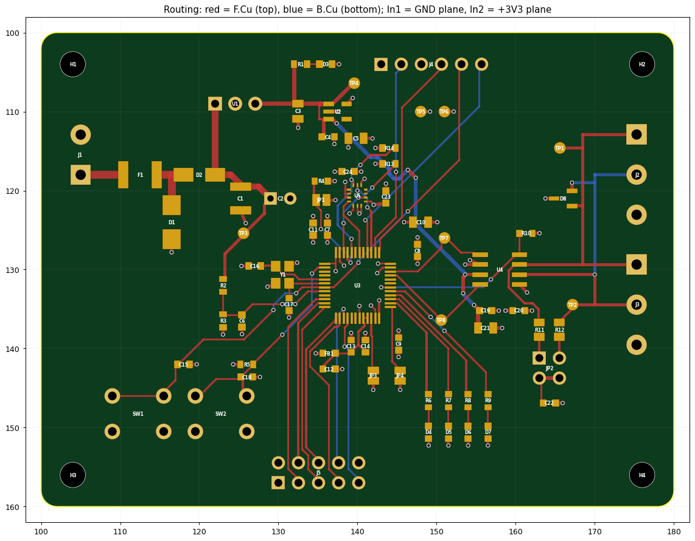

# PCB layout

| Item | Value |
|---|---|
| Size | **80 × 60 mm**, 2 mm corner radius, 4 × M3 holes (3.2 mm NPTH) at 4 mm from the edges |
| Stack-up | **4 layers, 1.6 mm, 1 oz outer / 0.5-1 oz inner** |
| Layers | F.Cu = components + signals + GND pour; **In1.Cu = solid GND plane**; **In2.Cu = +3V3 plane**; B.Cu = signals + GND pour |
| Rules | 0.20 mm clearance, 0.25 mm default track, 0.6/0.3 mm vias, 0.3 mm copper-to-edge, 0.25 mm zone clearance |
| Net classes | Default 0.25 mm; Power 0.5 mm (VIN 0.8-1.0 mm); CAN 0.4 mm |
| Assembly | all components on the top side; SMD 0603 minimum, one LGA-14 (IMU) and one 0.5 mm-pitch LQFP |

## Placement

* **Left edge:** J1 power input with F1 → D2 → C1/C2 → R-78E module in a straight left-to-right chain. The 1.0 mm / 0.8 mm VIN traces are on F.Cu, and TVS D1 sits right after the fuse.
* **Centre:** MCU (U3) with the crystal Y1 and its 15 pF caps directly left of OSC_IN/OSC_OUT (short, symmetric, over solid GND). The IMU (U5) sits just above the MCU.
* **Right edge:** CAN section.
  * U4 transceiver has TXD/RXD facing the MCU and CANH/CANL facing the connectors.
  * The ESD diode D8 and split termination R11/R12/C22/JP2 are next to the J2/J3 terminals.
  * CANH/CANL run as a pair (0.4 mm) from U4 to both connectors, over the GND plane.
* **Top:** SWD header J4 and the power LED. **Bottom:** J5 expansion header, the RESET/USER buttons and the 4 status LEDs with silkscreen labels.

## Routing approach

* **Hand-routed (explicit coordinates in `hardware/gen/routing.py`):** power chain, +5 V to the LDO, the CAN trunk to both connectors, the transceiver supply vias, and all MCU/IMU supply connections.
* **MCU supply connections:** the MCU supply pins connect *inward* to vias under the LQFP body. The escape area around the chip is then free for signals, and every VDD/VSS pin has its own via into the planes 0.2 mm below.
* **Other GND/+3V3 SMD pads:** each has its own short stub and via to the plane ("fan-out").
* **Remaining low-speed nets:** routed one at a time in a chosen priority order by a constrained grid router: 45° routing, turn and via penalties, exact clearance to real pad/track geometry. The order is crystal first, then CAN TX/RX, analog supply, IMU, SWD, LEDs, jumpers, expansion, then +5 V. Every result was checked by the independent DRC in `checks.py`.
* **Result:** 384 track segments, 103 vias, 0 clearance violations, 0 unconnected nets. Both planes are continuous for all their connections.

## Things to check in KiCad before ordering

1. Open `CAN_ECU.kicad_pcb` and press **B** (fill all zones). Then run **Inspect → Design Rules Checker**.
   * Expected result: no errors.
   * Silkscreen warnings may remain where reference texts touch other silk. Adjust them to taste.
2. Run **Inspect → Board Statistics** and check the layer stack in **Board Setup → Physical Stackup**. Set the stack-up your fab offers (e.g. JLC04161H-7628 or equivalent).
3. Look at thermal reliefs on the GND pads of J1, J2/J3 and the R-78E. KiCad's defaults (0.3 mm gap / 0.4 mm spokes) are fine for hand soldering.
