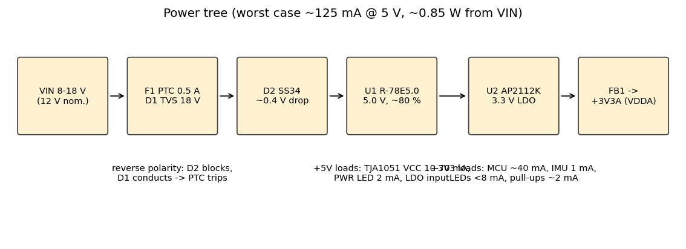

# Power budget and dissipation

## +3V3 rail (AP2112K-3.3, 600 mA rated)

| Load | Typical | Worst case | Note |
|---|---:|---:|---|
| STM32G431 @ 170 MHz, FDCAN+I2C+UART+ADC active | 30 mA | 40 mA | datasheet run-mode typical + peripherals |
| LSM6DS3TR-C (XL + G, 104 Hz high-performance) | 0.9 mA | 1.3 mA | |
| 4 status LEDs @ ~1.9 mA | 2 mA | 7.6 mA | typical = blinking duty cycle |
| I2C pull-ups (2 × 3.3 V / 4k7 when low) | 0.2 mA | 1.4 mA | |
| TJA1051 VIO, CAN_S pull-up (0.33 mA when S low), button pull-up | 0.5 mA | 1.0 mA | |
| **Total +3V3** | **≈ 34 mA** | **≈ 52 mA** | design budget 100 mA |

LDO dissipation, which scales with (5.0 − 3.3) V × I:

* At the 52 mA worst-case load: **88 mW**.
* At the 100 mA budget: **170 mW**.

With θJA ≈ 250 °C/W (SOT-23-5 on a 4-layer board, conservative) the temperature rise is +22 °C at worst case and +43 °C at the 100 mA budget. Both are fine.

## +5V rail (R-78E5.0-0.5, 500 mA rated)

| Load | Typical | Worst case | Note |
|---|---:|---:|---|
| TJA1051 VCC | 15 mA | 70 mA | 10 mA recessive / 50 typ-70 max mA dominant; typical at ~15 % bus load; worst = continuous dominant (bus fault) |
| Power LED D3 | 2 mA | 2 mA | |
| AP2112K input (= +3V3 load + 55 µA Iq) | 34 mA | 52 mA | |
| **Total +5V** | **≈ 51 mA** | **≈ 124 mA** | ≈ 25 % of module rating |

P_5V: typical 0.26 W, worst case 0.62 W.

## Input (VIN, 8-18 V)

The input power is estimated with:

* Module efficiency η ≈ 80 % at this light load. This is conservative; check the RECOM efficiency curve.
* Schottky D2 drop ≈ 0.35-0.45 V.

| VIN | P_in typical | I_in typical | P_in worst | I_in worst |
|---|---:|---:|---:|---:|
| 8 V | 0.34 W | 42 mA | 0.82 W | 103 mA |
| 12 V | 0.34 W | 28 mA | 0.80 W | 67 mA |
| 18 V | 0.33 W | 19 mA | 0.79 W | 44 mA |

**Total board power is ≈ 0.35 W typical and < 0.85 W worst case.**

Loss breakdown, worst case:

* Module: ≈ 0.16 W
* LDO: 0.09 W
* D2: 0.04 W
* TJA1051 (dominant): ≈ 0.2 W
* MCU: 0.13 W

Nothing needs a heatsink.

## Protection ratings

* **F1 PTC (hold 0.5 A):** normal current is ≤ 0.1 A, so the margin is 5×. It trips on a crowbar (reverse polarity) or a short.
* **D1 SMBJ18A:** V_RWM 18 V (maximum continuous input), V_BR ≥ 20 V, V_C 29.2 V @ 20.5 A.
* **D2 SS34:** 3 A / 40 V. Its reverse rating blocks a reversed 18 V input with margin.
* **C1:** 10 µF / 50 V X7R 1210.
* **C2:** 47 µF / 35 V electrolytic. It damps cable inductance ringing on hot-plug. It is **below** the module's 220 µF maximum capacitive load on the output side, and on the input side there is no limit.
